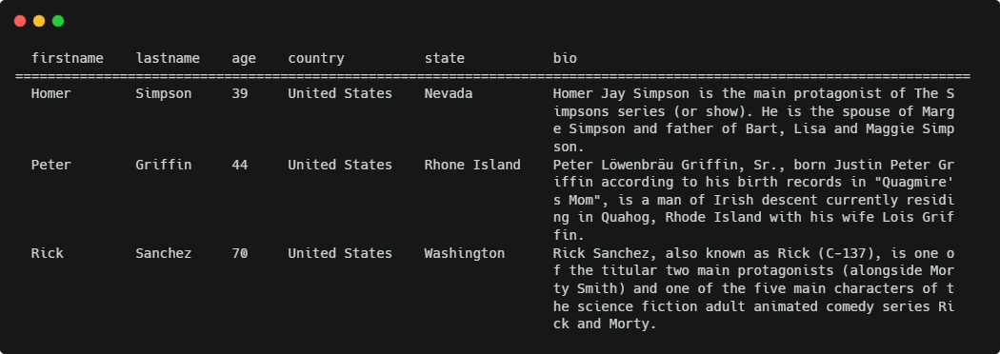
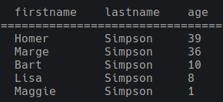

# voici.js

A Node.js library for displaying table data on the terminal.

[](https://nodei.co/npm/voici.js/)




## 📍 Introduction

voici.js (speak: [/vwasi/](https://dictionary.cambridge.org/dictionary/french-english/voici)) is an open source Node.js library written in TypeScript for beautifully displaying datasets in tabular format on the terminal including features like:

- Text / Column / Row styling
- Column sizing
- Accumulation
- Dynamic columns
- Data import from .json / .csv
- Table export to .png / .txt
- Sorting

## 💻 Installation

Install via npm:

```bash
npm i --save voici.js
```

## 🔨 Usage

```js
import { Table } from 'voici.js';

const data = [
  { firstname: 'Homer', lastname: 'Simpson', age: 39 },
  { firstname: 'Marge', lastname: 'Simpson', age: 36 },
  { firstname: 'Bart', lastname: 'Simpson', age: 10 },
  { firstname: 'Lisa', lastname: 'Simpson', age: 8 },
  { firstname: 'Maggie', lastname: 'Simpson', age: 1 }
];

const table = new Table(data);
table.print();
```

The console output:



You can find more examples [here](https://lars-waechter.gitbook.io/voici.js/examples).

## 📚 Documentation

The following documentations are available:

- [GitBook](https://github.com/larswaechter/voici.js)
- [TypeDoc](https://larswaechter.github.io/voici.js/)

Otherwise check out the [tests](https://github.com/larswaechter/voici.js/blob/master/tests/) for more examples.

## 🧩 Contributing

See [CONTRIBUTING.md](https://github.com/larswaechter/voici.js/blob/master/CONTRIBUTING.md)

## 🔑 License

voici.js is released under [MIT](https://github.com/larswaechter/voici.js/blob/master/LICENSE) license.
